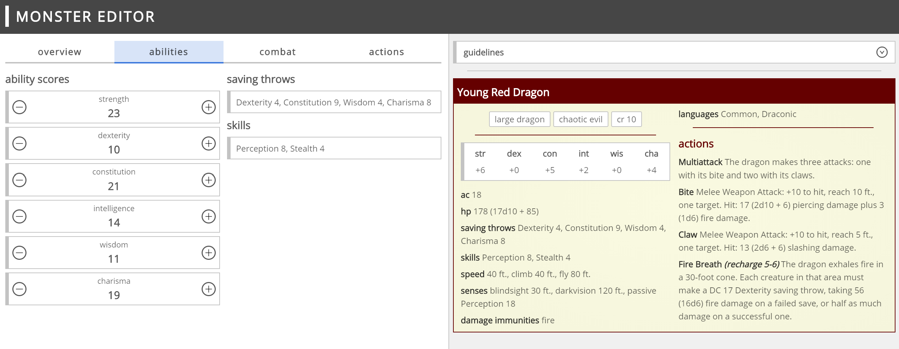
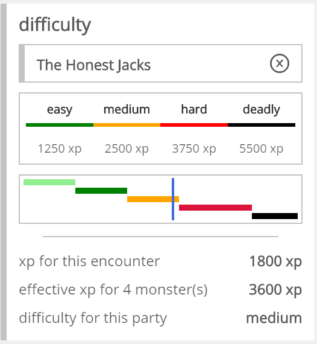
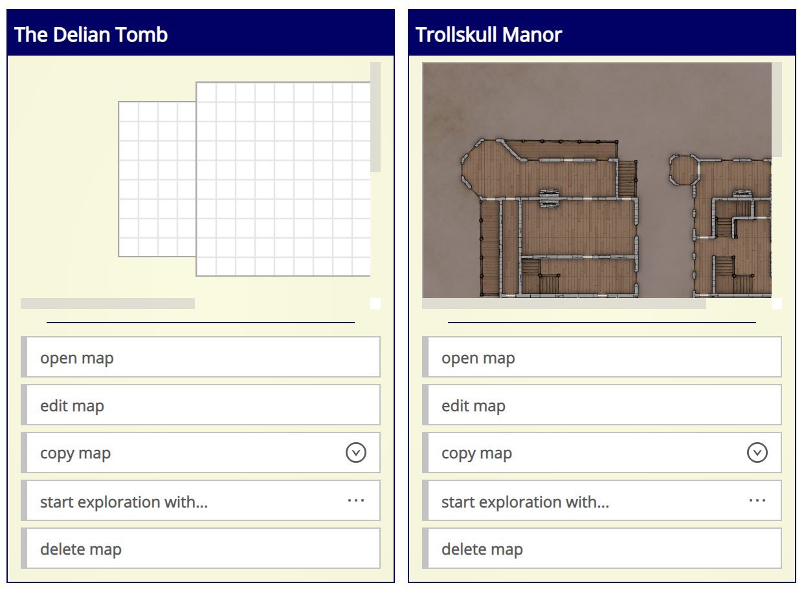
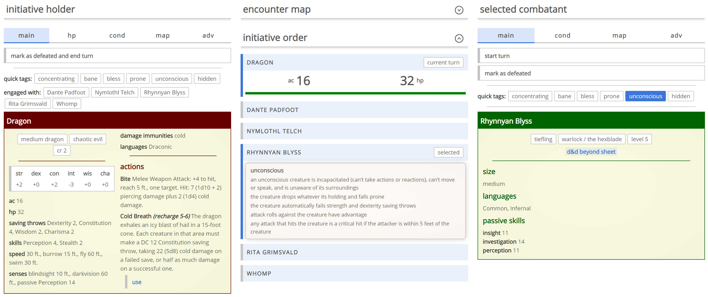
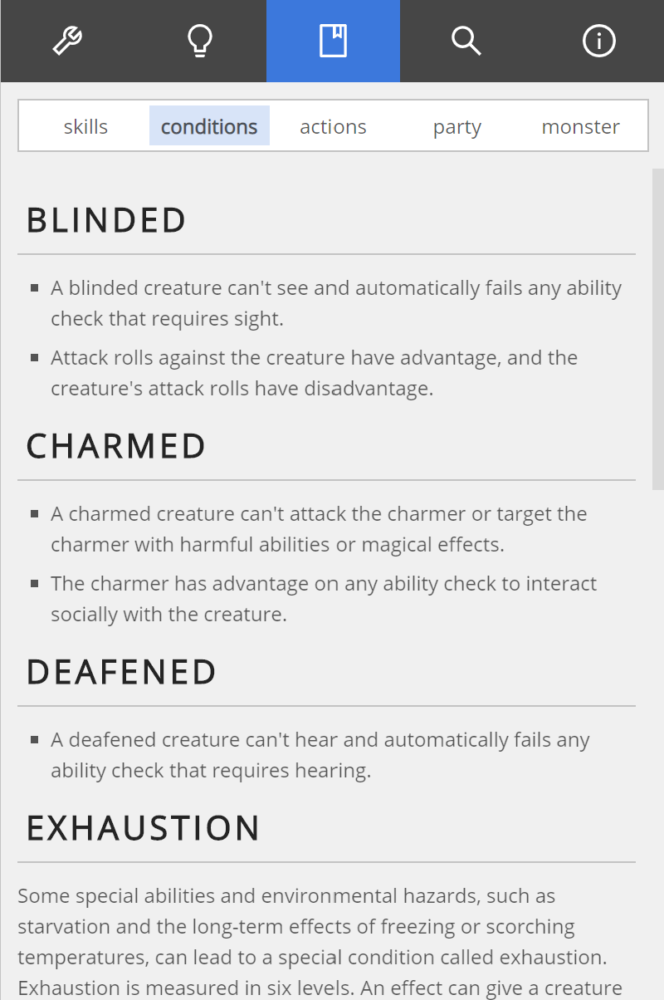

# dojo

Dojo is a web app for D&D (5E) dungeon masters.

You can find it at [https://andyaiken.github.io/dojo/](https://andyaiken.github.io/dojo/).

## Features

### Monster Designer

You can build your own monsters with the built-in monster designer, which lets you check your creations against other similar monsters. Or you can let the app do it for you - just select a few monsters and let it splice them together into a new hybrid monster.

The app comes with all the standard monsters from the official D&D system reference document, and you can also quickly import a monster from D&D Beyond.

### Encounter Builder

The encounter builder allows you to build combat encounters, and even split an encounter into multiple waves. You can check your encounter's difficulty for a group of PCs, and the calculations are all done for you. You can even ask it to build you a totally random encounter.

### Tactical Maps

You can create your own tactical maps by placing and dragging map tiles around a board, or by importing image files. Your map can include standard features like doors and stairs, and you can add notes to significant locations on the map.

With the click of a button you can add a random room to the map, or generate an entirely random three-room dungeon delve or a larger ten-room dungeon.

Maps you create can then be used in the...

### Combat Manager

The app can help you to run combat encounters, taking care of the initiative order, monster hit points, and conditions. You can see at a glance which combatants are concentrating, which are prone or unconscious, which are affected by spells like *bless* and *bane*. If your encounter contains a monster with a rechargable action, the app will prompt you to roll to recharge it. The app will also remind you about legendary actions and lair actions.

If you're using a tactical map for your encounter, you can move tokens around the map, or add overlays to represent significant regions (such as spell effects or monster auras).

If you have a second display, the app can show a separate window including the initiative list (which includes relevant condition information) and a copy of the map, if you're using one.

### DM Tools

Who needs a DM screen, when you have all this at your fingertips?

- a **die roller** if you want to go all-digital
- a **name generator** for NPCs
- **references** for skills, conditions, and combat actions
- a **text generator** that can quickly give you whole paragraphs of Elvish, Dwarvish, Orcish, Draconic, and so on

---
---

## Contributing

Dojo is written in TypeScript / JavaScript, using React and SCSS. If you would like to contribute to this project, you are welcome to do so.

### Initial set up

You will need to have `Git` and `Node.js` installed.

* Open a terminal in the root folder
* Run `npm install`
* Check that you're using the latest dependencies by running `npm update`

### Compiling and running the app

* Open a terminal in the root folder
* Run `npm start`

Your default browser should open; if it does not, open it and navigate to [http://localhost:3000](http://localhost:3000).

The page should automatically reload if you make edits.

If there are any build errors, you will see them in the terminal and the browser debug console.

### Making a change to the app

Check that your changes don't break the project's style rules:

* Open a terminal in the root folder
* Run `npm run lint`

Remember to update the app version number in `package.json` before pushing any change to the repository.

### Publishing a new version of the app

* Open a terminal in the root folder
* Run `npm run deploy`

This will build the app in the `build` folder and attempt to deploy it.
